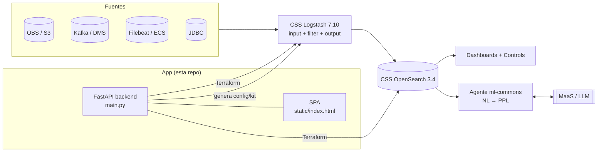

# CSS Accelerator

**Acelerador para montar un stack de análisis de logs + asistente de IA sobre Huawei Cloud
Cloud Search Service (CSS).** De un log crudo a un pipeline de Logstash, index template,
dashboards curados, forecasting y un chatbot conversacional que traduce lenguaje natural a
consultas — sin escribir el parseo a mano.

Corre como una app local (FastAPI + SPA) que arma y despliega todo sobre **CSS OpenSearch 3.4 +
CSS Logstash 7.10** en tu cuenta de Huawei Cloud.

> ⚠️ **Solución de referencia**, no un producto con soporte. Se entrega "as is" (ver `LICENSE`).
> Revisá y adaptá los recursos antes de usarla en producción.

---

## ¿Qué resuelve?

Poner logs a producir valor en OpenSearch normalmente implica: escribir el `filter{}` de Logstash,
definir el index template con los tipos correctos, armar dashboards, y —si querés un asistente—
provisionar los modelos y el agente de ml-commons a mano. Este acelerador automatiza esas cuatro
cosas a partir de **una muestra del log**.

Dos maneras de usarlo:

- **Demo** — 8 escenarios verticales pre-armados (SIEM, FortiAnalyzer, wallet/pagos, ALyC,
  oil & gas, e-commerce, streaming, salud): dataset sintético, pipeline, index template, dashboards
  curados, forecasts y chatbot, desplegados con Terraform en un par de clicks.
- **Builder** — traés tu propio log: pegás unas líneas, un LLM (GLM) infiere la estructura y arma
  el pipeline; elegís la fuente (OBS, Kafka, Beats, JDBC…) y te llevás **todo en un documento**
  listo para ejecutar, o lo desplegás.

---

## Capacidades

| Capacidad | Detalle |
|---|---|
| **Builder de pipeline** | Pegás log crudo → un LLM (GLM) arma el `filter{}` de Logstash (grok/json/kv/csv/dissect, namespacing, `@timestamp`). |
| **Multi-fuente** | Inputs: **OBS/S3**, **Kafka** (incl. Huawei **DMS for Kafka**, plaintext y **SASL_SSL**), **Beats/Filebeat**, **JDBC**, HTTP, File. |
| **Index templates** | Genera el `_index_template` con los tipos inferidos y namespacing por campo. |
| **Dashboards curados** | Un dashboard por vertical (métricas, series, tablas top-N) + panel de **Controls** para filtrar. |
| **Chatbot NL→PPL** | Agente conversacional de OpenSearch (ml-commons): traduce preguntas en lenguaje natural a **PPL** y responde con el dato real. Secuencia Dev Tools generada por el kit. |
| **Forecasting** | Forecasters (RCF) sobre las series de volumen del vertical. |
| **Deploy con Terraform** | Levanta los clusters CSS (OpenSearch + Logstash) + NAT/DNAT en tu cuenta. |
| **Registro declarativo** | Cada vertical se define en **un solo módulo** `verticals/<slug>.py`; backend y frontend lo consumen. |

---

## Arquitectura



- **Backend**: FastAPI (`main.py`) — onboarding, generación de pipeline/kit, capabilities
  (chatbot/forecasts), deploy Terraform, settings.
- **Frontend**: SPA en un solo archivo (`static/index.html`) — wizard, infraestructura, config.
- **Registro de verticales**: `verticals/` (un módulo por vertical) → inyectado en `GET /` como
  `window.__VERTICALS__`, y leído por `capabilities.py` / `dashboards.py`.
- **LLM**: Huawei **MaaS (ModelArts as a Service)**, compatible con la API de OpenAI. GLM para
  armar el pipeline; DeepSeek para el agente (razonador + generador de PPL).

---

## Prerequisitos

| Qué | Para qué |
|-----|----------|
| **Docker + Docker Compose** | correr la app (camino normal — trae Python y Terraform adentro) |
| Cuenta Huawei Cloud con permisos CSS / OBS / VPC / NAT | los recursos de la demo/deploy |
| Acceso a MaaS (ModelArts as a Service) con API key | análisis de logs con LLM + chatbot |

En tu cuenta necesitás (una vez, por consola): una **VPC + subnet + security group** en la región
que uses, y anotar sus IDs. El resto (clusters, NAT, EIP, bucket) lo crea la plataforma.

---

## Arranque

**Camino normal — con Docker.** La imagen trae Python y Terraform adentro; en el host solo
necesitás Docker.

```bash
docker compose up --build
```

Abrí <http://localhost:8088> y andá a **⚙ Configuración**:

1. **Credenciales OBS** — AK/SK de tu cuenta (se guardan en tu navegador).
2. **Cuenta Huawei Cloud** — project id, región, VPC/subnet/security group, availability zone y el
   bucket de demos. Se guardan en el servidor (`.platform_settings.json`, gitignoreado).
3. **Preparar bucket de demos** — sube los datasets a tu bucket (ver [Datasets](#datasets)).
4. **MaaS API Key** — tu key de MaaS (o la del cliente en una PoC).

Eso es todo — no hay que crear archivos a mano: la config de ⚙ y el estado de Terraform se
persisten en volúmenes. El puerto es host **8088** → contenedor 8000 (cambialo en `docker-compose.yml`).
Config opcional por entorno: copiá `.env.example` a `.env`. No hace falta Docker para OpenSearch/
Logstash — eso lo provee CSS en la nube.

---

## Los dos flujos

### Demo
**Crear pipeline → elegir uno o varios verticales → Desplegar.** El primer deploy tarda ~20 min
(clusters CSS); los siguientes reusan el entorno. Cada vertical trae dataset, pipeline, template,
dashboards, forecasts y chatbot.

### Builder (traé tu propio log)
Toggle **"Builder (tu log → kit)"** en el paso 1:

1. Pegás unas líneas del log → **Siguiente** dispara el análisis con el LLM (arma el `filter{}` y
   detecta campos).
2. Revisás/ajustás el mapping.
3. Elegís la **fuente** (OBS / Kafka / Beats / JDBC) y sus datos de conexión; output OpenSearch.
4. **Exportás el Starter Kit** (un documento Markdown con config + index template + dashboards +
   runbook de consola + comandos del chatbot y forecasts), o desplegás.

De dónde sacar la muestra según la fuente:

| Fuente | Muestra |
|---|---|
| **OBS** | Descargá un objeto del bucket, o usá el atajo de la UI. |
| **Kafka** | `kafka-console-consumer --topic <topic> --bootstrap-server <host:9092> --max-messages 3` (o el **Message Query** de la consola DMS). |
| **Beats** | `tail -n 3 </var/log/tu-app.log>` (el path de `filebeat.inputs`, **no** el registry). |
| **JDBC** | `SELECT * FROM <tabla> LIMIT 3`. |

Ver [`docs/guides/custom-builder-kafka-beats.md`](docs/guides/custom-builder-kafka-beats.md) para el
paso a paso completo con **Kafka DMS** y **Filebeat en una VM**.

---

## Chatbot NL → PPL

El asistente conversacional de OpenSearch (ml-commons) traduce preguntas en lenguaje natural a
consultas **PPL** y responde con el dato. El kit genera la **secuencia completa de comandos Dev
Tools** para provisionarlo (cluster settings → connectors → modelos → agente root → bind del
Assistant). Ver el runbook universal en
[`docs/guides/chatbot-nl-to-ppl.md`](docs/guides/chatbot-nl-to-ppl.md).

---

## Datasets

Los datasets **no se versionan** (pesan varios GB). Se regeneran con los build scripts:

```bash
python build_vertical_datasets.py   # verticales (wallet, alyc, streaming, e-commerce, salud, oil&gas)
python build_siem_dataset.py        # SIEM (auth, cloudaudit, fortigate, waf)
python build_fraud.py               # fraud detection (requiere el dataset IEEE-CIS, ver datasets/README.md)
```

Ver [`datasets/README.md`](datasets/README.md) para el detalle de cada uno y de dónde sale la data
base. Luego se suben al bucket OBS desde **⚙ Configuración → Preparar bucket de demos**.

---

## Deploy con Terraform

El HCL de los clusters CSS + NAT/DNAT vive en [`terraform/`](terraform/). El backend inyecta las
variables (credenciales, VPC, pipeline generado) y corre `terraform apply` por vos desde la UI.
Para correrlo a mano: copiá `terraform/terraform.tfvars.example` a `terraform.tfvars`, completá los
valores y `terraform init && terraform apply`. Ver [`terraform/README.md`](terraform/README.md).

---

## Estructura del repo

```
main.py                 Backend FastAPI (onboarding, kit, capabilities, deploy, settings)
maas_integrator.py      Integración con MaaS/LLM (análisis de log, generación de filter)
capabilities.py         Builders del chatbot (connectors, modelos, agente) y forecasts
dashboards.py           Motor de dashboards (ndjson) desde el registro de verticales
index_template.py       Generación del _index_template
plugin_rag.py           Catálogo/RAG de plugins de Logstash para el LLM
verticals/              Registro declarativo: un módulo por vertical (card, filter, campos,
                        capability spec, dashboard, preguntas, datasets)
static/index.html       Frontend completo (SPA)
terraform/              HCL de los clusters CSS + NAT/DNAT
docs/                   Contexto para el LLM, dashboards de referencia, guías (docs/guides/)
datasets/               README de regeneración (la data no se versiona)
tests/                  Suite de integración
```

---

## Agregar un vertical de demo

Toda la definición vive en **un solo módulo** `verticals/<slug>.py` (card del grid, filtro Logstash,
campos, capability spec del chatbot/forecasts, dashboard, preguntas, vocabulario de industria y
datasets). Backend y frontend lo consumen del registro `verticals/__init__.py` — no hay que tocar
7 lugares.

1. Copiá un módulo existente (ej. `verticals/transacciones_alyc.py`) y editá el dict `VERTICAL`
   (ver el docstring de `verticals/__init__.py` para el shape).
2. Importalo y sumalo a `_MODULES` en `verticals/__init__.py`; si estrena grupo, agregalo a `GROUPS`.
3. Poné el dataset en `datasets/<archivo>.log` (el `dataset_files` del módulo) y regenerá los
   dashboards de disco: `python -m dashboards`.
4. `python -m pytest tests/test_integration.py -q` para validar.

---

## Tests

```bash
python -m pytest tests/test_integration.py -q
```

Ver [`TESTING.md`](TESTING.md) para el detalle.

---

## Troubleshooting

- **"Faltan los datasets de demo en el bucket…"** → ⚙ Configuración → Preparar bucket de demos.
- **`terraform` not found** → instalá Terraform CLI y reabrí la terminal.
- **El chatbot no responde / análisis LLM falla** → revisá la MaaS API key en ⚙ Configuración.
- **Deploy falla con error de VPC/subnet** → los IDs de ⚙ Configuración deben ser de la MISMA región.
- **Kafka DMS no conecta** → si el instance usa autenticación es SASL_SSL (puertos 9093/9095); tildá
  SASL_SSL en el paso 3 del builder y cargá mecanismo, credenciales y truststore.

---

## Licencia

Apache-2.0 — ver [`LICENSE`](LICENSE). Marcas y nombres de producto pertenecen a sus dueños
respectivos. Esta es una solución de referencia provista sin garantía.
